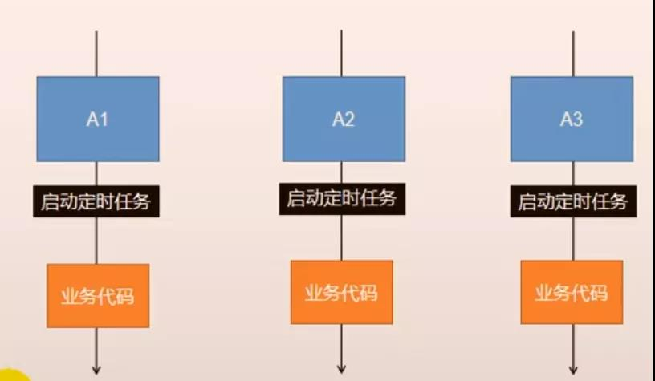
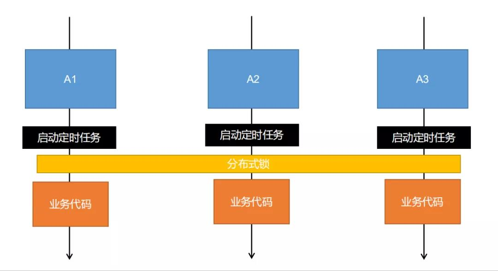
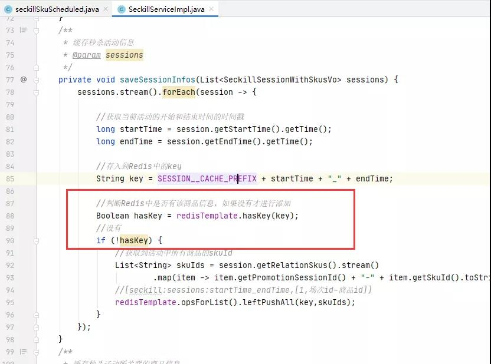

# 杂记三、幂等性详解


## 1.什么是幂等性？

幂等性：提交一次和多次，结果是一样的。

## 2.哪些情况需要保证幂等性？

用户多次点击按钮；
用户页面回退再次提交；
微服务相互调用，由于网络原因，导致请求失败，feign触发重试机制；
其他业务情况；

## 3.什么情况下需要幂等性？

以SQl为例，有些操作时天然幂等。
select * from table where id =? 无论查询多少次都不会改变状态，是天然幂等的。
update table set col=1 where col2=2,无论执行操作多少次都不会改变状态，是天然幂等的。
delete from user where userId=1,多次操作，结果一样幂等操作。
inter into user(id,name)values(1,‘a’),如id唯一主键，即重复操作上面的业务，只会插入一条数据，具备幂等性；

**update table1 set col1=col1+1 where col2=2,每次执行的结构都会发生变化，不是幂等。**
**inter into user(id,name)values(1,‘a’),如id不是主键，即重复操作上面的业务，会插入多条数据，不具备幂等性；**

## 4.幂等解决方案？

```
4.1 token机制
    1.服务端提供了发生token的接口。我们在分析业务的时候，哪些业务是存在幂等问题的，就必须在执行业务前，先去
    获取token,服务器会把token保存到redis中。
    2.然后在调用业务接口请求时，把token携带过去，一般放在请求头部。
    3.服务器判断token是否存在于redis中，存在表示第一次请求，然后删除token，继续执行业务
    4.如果判断token不存在redis中，就表示是重复操作，直接返回重复标记给客户端，这样就保证了业务代码，不被重复执行

    危险性：
    1、先删除token还是后删除token
        如果是后删除令牌，用户点提交订单，连续点两次，第一次提交订单，还没执行完，还没来得及删除令牌，
        第二次的提交订单就进来，这样就出现数据不一致的问题了。

        如果是先删除令牌，一般分布式下，token存redis里，假设用户还是点的很快，连续点了两次提价订单，
        两个请求同时去redis里获取token，同时对比成功，同时删令牌，同时执行业务逻辑，这就会出现一定的
        风险

        因此，如果是先删除令牌，获取redis里的令牌操作，和前端带来的token比较的操作以及删除令牌的操作，
        即：获取，对比，删除 这三个操作必须是原子的，给上个分布式锁
4.2 各种锁机制
     1、数据库悲观锁
        select * from XXX where id=1 for update;
        悲观锁使用时伴随着事务一起使用，数据锁定时间可能会很长，需要根据实际情况选用。另外要注意的是，id
        字段一定是主键或者唯一索引，不然可能造成锁表的结果，处理起来非常麻烦。
     2、数据库乐观锁
        这种方式适合在更新的场景中。
     3、业务层分布式锁
        如果多个机器可能在同一时间同时处理相同的数据，比如多台机器定时任务都拿到了相同数据处理，我们就可以
        加分布式锁，锁定此数据，处理完成后释放锁。获取到锁的必须先判断这个数据是否被处理过。
4.3 各种唯一约束
      1、数据库唯一约束
        插入数据，应该按照唯一索引进行插入，比如:订单号，相同的订单号就不能有两条记录插入。
        我们在数据库层面防止重复。
        这个机制是利用了数据库的主键唯一约束的特性，解决了在insert场景时幂等问题。
        但主键的要求不是自增的主键，这样就需要业务生成全局唯一的主键。
        如果是分库分表场景下，路由规则要保证相同请求下，落在同一个数据库和同一表中，要不然数据库约束就不起
        效果了，因为是不同的数据库和表主键不想关
       2、redis set防重
       很多数据需要处理，只能被处理一次，比如我们可以计算数据的MD5将其放入redis的set，每次处理数据，先看
       md5是否存在，存在就不处理。
4.4 防重表
       使用订单号orderNo做为去重表的唯一索引，把唯一索引插入去重表，再进行业务操作，且他们在同一个事务中，
       这个保证了重复请求时，因为去重表有唯一约束，导致请求失败，避免了幂等问题。注意，去重表和业务表应该在
       同一数据库中，这样就保证了在同一个事务，即使业务操作失败，也会把去重表的数据回滚。这个很好的保证了数
       据一致性。
4.5 全局请求唯一id
        调用接口时，生成一个唯一id,redis将数据保存到集合中(去重)，存在即处理过，可以使用nginx设置每一个
        请求的唯一id proxy_set_header X-Request-Id $request_id;
```

下面展示几种用过的方案

### 一、token机制解决幂等性

场景：订单确认页，可以点击提交订单按钮，来提交订单，用户可能连续点击提交订单按钮，这个业务可能会出现幂等性问题。

确认订单接口的服务：
使用`uuid`生成一个防重令牌`token`，并把`token`放到`redis`里，然后把这个`token`，封装到出参，给到前端的订单确定页面

```java
    @Autowired
    private RedisTemplate redisTemplate;
    /**
     * 确认订单
     * @return
     */
    @Override
    public OrderConfirmVo confirmOrder() {
        //1.异步任务1 - 远程查询所有的收货地址列表
        xxx
        //2.异步任务2 - 远程查询购物车所有选中的购物项
        xxxx

        //3.查询用户积分
        xxx

        //4.其他数据自动计算

        //5.防重令牌
        String token = UUID.randomUUID().toString().replace("-", " ");
        redisTemplate.opsForValue().set(OrderConstant.USER_ORDER_TOKEN_PREFIX+memberResponseVo.getId(),token,30, TimeUnit.MINUTES);
        orderConfirmVo.setOrderToken(token);

        return orderConfirmVo;
    }
```

提交订单服务：

```java
    @Autowired
    private RedisTemplate redisTemplate;
    @Transactional
    @Override
    public SubmitOrderResponseVo submitOrder(OrderSubmitVo orderSubmitVo) {
        //1、验令牌【令牌：获取，对比，删除。必须保证原子性】
        //前端传的token
        String token = orderSubmitVo.getOrderToken();
        //0令牌验证失败  1验证成功
        String script = "if redis.call('get', KEYS[1]) == ARGV[1] then return redis.call('del', KEYS[1]) else return 0 end";
        //lua脚本保证原子性：获取令牌，验证令牌和删除令牌
        Long result = (Long) redisTemplate.execute(new DefaultRedisScript<Long>(script, Long.class),
                Arrays.asList(OrderConstant.USER_ORDER_TOKEN_PREFIX + memberResponseVo.getId()),
                token);
        //验证失败
        if (result==0){
            submitOrderResponseVo.setCode(1);
            return submitOrderResponseVo;
        }
        //验证成功
        else {
            //下单
            xxx

            //验价
            xxx

            //保存订单
           xxx

            //库存锁定。只要有异常回滚订单数据
            //需要：订单号，所有订单项(sku_id,sku_name)，锁几件
            //远程锁库存
            xxx
        }
    }
```

### 二、防重表解决幂等性

场景：下订单出现异常，需要回退远程服务的库存。假设使用的是可靠消息最终一致性方案，如果回退库存的业务执行成功了，但是在返回给`mq`的`ack`，因为网络问题没发给消息队列，消息队列认为消息没消费成功，再次给库存服务发消息，去再次回退库存，这就出现数据不一致的问题了。

为了保证消息处理的幂等性。处理过的消息会存到数据库中去(`trade_mq_consumer_log`防重表),消费者接受一条消息，不是拿来立马就消费，而是拿来判断一下有没有处理过，如果已经处理过，就不用了处理了，因为如果提供者给你发重复的消息，你进行重复消息，存库连续回退，数值肯定对不上。因此，消息的幂等性，需要在消费端进行保证的。
具体做法：通过存储消息的表的字段，组名，tag，key以及消费状态(处理成功表示消费了)，判断当前消息是否消费过。

防重表示例：

```mysql
CREATE TABLE `trade_mq_consumer_log` (
  `msg_id` varchar(50) DEFAULT NULL COMMENT '消息id',
  `group_name` varchar(100) NOT NULL COMMENT '消费者组名',
  `msg_tag` varchar(100) NOT NULL COMMENT 'tag',
  `msg_key` varchar(100) NOT NULL COMMENT 'key',
  `msg_body` varchar(500) DEFAULT NULL COMMENT '消息体 json格式',
  `consumer_status` int(1) DEFAULT NULL COMMENT '0:正在处理;1:处理成功;2:处理失败',
  `consumer_times` int(1) DEFAULT NULL COMMENT '消费次数',
  `consumer_timestamp` timestamp NULL DEFAULT NULL COMMENT '消费时间',
  `remark` varchar(500) DEFAULT NULL COMMENT '备注',
  PRIMARY KEY (`group_name`,`msg_tag`,`msg_key`)
) ENGINE=InnoDB DEFAULT CHARSET=utf8;
```

例如：

```java
@RocketMQMessageListener(topic = "${mq.order.topic}",
        consumerGroup ="${mq.order.consumer.group.name}",
        messageModel = MessageModel.BROADCASTING  //广播模式
)
@Component
@Slf4j
public class CancelMQListener implements RocketMQListener<MessageExt> {
    。。。
    @Override
    public void onMessage(MessageExt message) {
        String msgId=null;
        String tags=null;
        String keys=null;
        String body=null;
        try {
            //1.解析消息内容
            msgId = message.getMsgId();
            tags = message.getTags();
            keys = message.getKeys();
            body = new String(message.getBody(), "UTF-8");
            log.info("接受消息成功");

            //2.查询消息消费记录
            TradeMqConsumerLogKey tradeMqConsumerLogExample=new TradeMqConsumerLogKey();
            tradeMqConsumerLogExample.setGroupName(groupName);
            tradeMqConsumerLogExample.setMsgTag(tags);
            tradeMqConsumerLogExample.setMsgKey(keys);
            TradeMqConsumerLog tradeMqConsumerLog = tradeMqConsumerLogMapper.selectByPrimaryKey(tradeMqConsumerLogExample);
            //3.判断 如果消费过
            if (tradeMqConsumerLog!=null) {
                //获取消息的处理状态 0:正在处理;1:处理成功;2:处理失败
                Integer consumerStatus = tradeMqConsumerLog.getConsumerStatus();
                //处理过
                if (ShopCode.SHOP_MQ_MESSAGE_STATUS_SUCCESS.getCode().intValue() == consumerStatus.intValue()) {
                    log.info("消息：" + msgId + "处理过");
                    return;
                }
                //正在处理
                if (ShopCode.SHOP_MQ_MESSAGE_STATUS_PROCESSING.getCode().intValue() == consumerStatus.intValue()) {
                    log.info("消息：" + msgId + "正在处理");
                    return;
                }
                //处理失败
                if (ShopCode.SHOP_MQ_MESSAGE_STATUS_FAIL.getCode().intValue() == consumerStatus.intValue()) {
                    //消费次数已经大于3次
                    if (tradeMqConsumerLog.getConsumerTimes()>3){
                        log.info("消息：" + msgId + "，处理超过三次，不能再进行处理了");
                        return;
                    }
                    //消费次数小于三次
                    //状态设置为正在处理
                    tradeMqConsumerLog.setConsumerStatus(ShopCode.SHOP_MQ_MESSAGE_STATUS_PROCESSING.getCode());
                    //updateByExampleSelective方法默认支持数据库乐观锁
                    //设置并发修改条件
                    TradeMqConsumerLogExample tradeMqConsumerLogExample1=new TradeMqConsumerLogExample();
                    TradeMqConsumerLogExample.Criteria criteria=tradeMqConsumerLogExample1.createCriteria();
                    criteria.andMsgTagEqualTo(tradeMqConsumerLog.getMsgTag());
                    criteria.andMsgKeyEqualTo(tradeMqConsumerLog.getMsgKey());
                    criteria.andGroupNameEqualTo(groupName);
                    //消费次数相当于是乐观锁的version,只不过这里的version人为规定不能大于3
                    criteria.andConsumerTimesEqualTo(tradeMqConsumerLog.getConsumerTimes());
                    int i = tradeMqConsumerLogMapper.updateByExampleSelective(tradeMqConsumerLog, tradeMqConsumerLogExample1);
                    if (i<=0){
                        //未修改成功，其他线程并发修改
                        log.info("并发修改，稍后处理");
                    }
                }
            }
            //4.判断 如果没有消费过
            else {
                tradeMqConsumerLog=new TradeMqConsumerLog();
                tradeMqConsumerLog.setMsgTag(tags);
                tradeMqConsumerLog.setMsgKey(keys);
                tradeMqConsumerLog.setGroupName(groupName);
                //消息状态改为正在处理
                tradeMqConsumerLog.setConsumerStatus(ShopCode.SHOP_MQ_MESSAGE_STATUS_PROCESSING.getCode());
                tradeMqConsumerLog.setMsgBody(body);
                //消费次数，指的是消费失败时才记录
                tradeMqConsumerLog.setConsumerTimes(0);
                tradeMqConsumerLog.setMsgId(msgId);

                //将消息处理信息添加到数据库
                tradeMqConsumerLogMapper.insert(tradeMqConsumerLog);
            }
            //5.回退库存
            。。。。

            //6.记录消息消费记录,更改消息处理状态为成功处理
            tradeMqConsumerLog.setConsumerStatus(ShopCode.SHOP_MQ_MESSAGE_STATUS_SUCCESS.getCode());
            tradeMqConsumerLog.setConsumerTimestamp(new Date());
            tradeMqConsumerLogMapper.updateByPrimaryKey(tradeMqConsumerLog);
            log.info("回退库存成功");
        } catch (Exception e) {
            e.printStackTrace();
            //如果消息处理失败，需要记录
            //先查询消息消费记录表有没有数据
            TradeMqConsumerLogKey tradeMqConsumerLogKey=new TradeMqConsumerLogKey();
            tradeMqConsumerLogKey.setGroupName(groupName);
            tradeMqConsumerLogKey.setMsgTag(tags);
            tradeMqConsumerLogKey.setMsgKey(keys);
            TradeMqConsumerLog tradeMqConsumerLog = tradeMqConsumerLogMapper.selectByPrimaryKey(tradeMqConsumerLogKey);
            //没有，就将当前消息消费失败的信息，插进去
            if (tradeMqConsumerLog==null){
                tradeMqConsumerLog=new TradeMqConsumerLog();
                tradeMqConsumerLog.setMsgTag(tags);
                tradeMqConsumerLog.setMsgKey(keys);
                tradeMqConsumerLog.setGroupName(groupName);
                //消息状态改为正在处理
                tradeMqConsumerLog.setConsumerStatus(ShopCode.SHOP_MQ_MESSAGE_STATUS_PROCESSING.getCode());
                tradeMqConsumerLog.setMsgBody(body);
                //消费次数，指的是消费失败时才记录
                tradeMqConsumerLog.setConsumerTimes(1);
                tradeMqConsumerLog.setMsgId(msgId);
                tradeMqConsumerLogMapper.insert(tradeMqConsumerLog);
            }
            //如果已经有消息消费记录，更新消费次数
            else {
                tradeMqConsumerLog.setConsumerTimes(tradeMqConsumerLog.getConsumerTimes()+1);
                tradeMqConsumerLogMapper.updateByPrimaryKeySelective(tradeMqConsumerLog);
            }
        }
    }
}
```

### 三、业务层分布式锁

场景：
多台机器定时任务都拿到了相同数据处理，我们就可以加分布式锁，锁定此数据，处理完成后释放锁。获取到锁的必须先判断这个数据是否被处理过。

例如：每天凌晨3点定时上架最近三天参与秒杀的商品，三台机器A1,A2,A3,都有一个定时任务，同一段程序，定时任务的设置都一样，等时间一到，它们就都同时启动了定时任务，就要同时执行业务代码，同时去上架秒杀商品，就会出问题



解决：
应该是定时任务，只能有一台机器在执行，不能所有机器同时执行。
使用分布式锁解决。



使用分布式锁解决了定时任务在分布式下的问题：

```java
@Slf4j
@Service
public class seckillSkuScheduled { 
    @Autowired
    private SeckillService seckillService;
    @Autowired
    private RedissonClient redissionClient;

    private final String upload_lock="seckill:upload:lock";

    //保证幂等性问题
    @Scheduled(cron = "*/5 * * * * ?")
    public void uploadSeckillSkuLatest3Days() { 
        log.info("上架秒杀的商品");

        //分布式锁
        RLock lock = redissionClient.getLock(upload_lock);
        //锁的超时时间
        lock.lock(10, TimeUnit.SECONDS);
        try{ 
            seckillService.uploadSeckillSkuLatest3Days();
        }finally { 
            //释放锁
            lock.unlock();
        }
    }
}
```

还有就是要通过业务层代码来控制幂等性：
比如：每晚都要缓存最近三天参与秒杀的商品，那缓存时就要注意已经存在的商品，不能再重复缓存




  